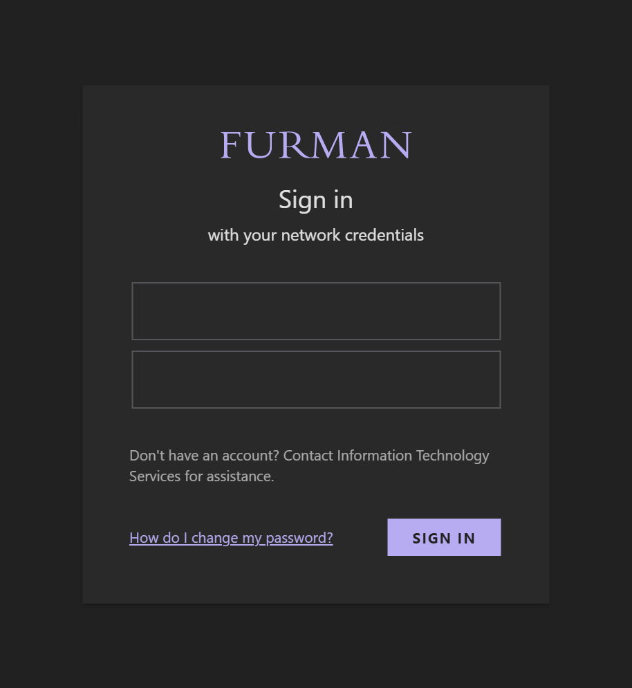
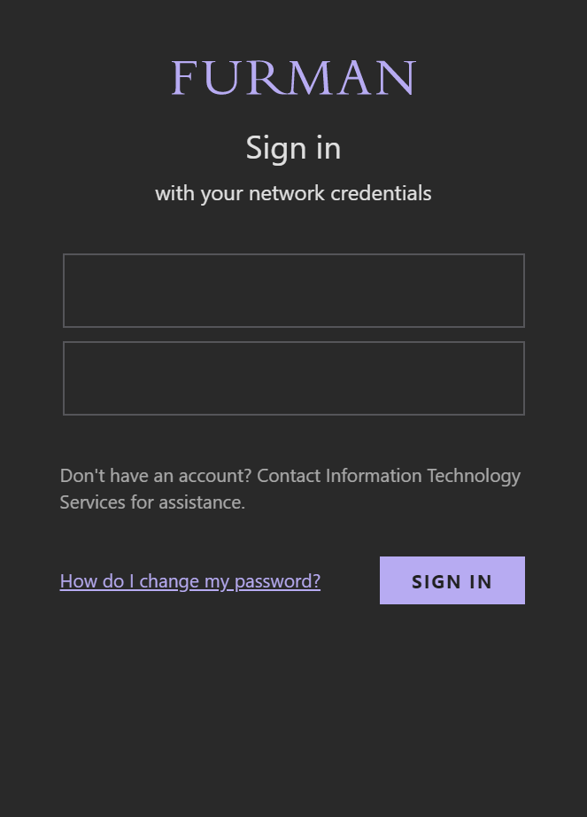

# WebAssign Improved
This style modernizes the Furman Single Sign-On (SSO) UI and adds a dark theme (activated when system is in dark mode).

Both SSO pages are themed.

## Preview
|Desktop|Mobile|
|---|---|
|||

## Installation

Install [Stylus](https://add0n.com/stylus.html) for either [Firefox](https://addons.mozilla.org/en-US/firefox/addon/styl-us/), [Chrome](https://chrome.google.com/webstore/detail/stylus/clngdbkpkpeebahjckkjfobafhncgmne) or [Opera](https://addons.opera.com/en-gb/extensions/details/stylus/) and then install the style using one of these methods:

📦 [Install the usercss](https://github.com/jackbuehner/furman-sso-improved/raw/master/furman-sso-improved.user.css) which supports automatic updates. 

If you would like to contribute to this repository, please...

1. Fork this repository
1. Make your changes
1. Create a pull request
